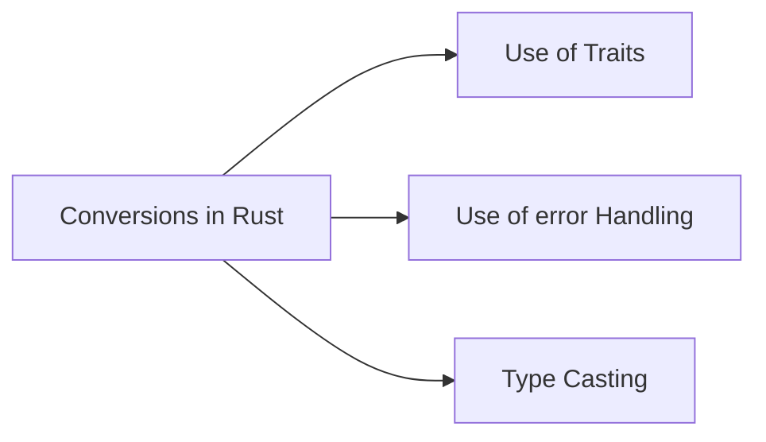

Here’s a comprehensive series of tutorials on **Rust conversions** from basic to advanced use cases, including the use of traits, error handling, and type casting. This tutorial includes 20 examples, all implemented in `lib.rs`, and results demonstrated in `main.rs`.



### Project Structure

```
my_conversion_project/
├── Cargo.toml
└── src/
    ├── lib.rs
    └── main.rs
```

### 1. **Cargo.toml**

```toml
[package]
name = "my_conversion_project"
version = "0.1.0"
edition = "2021"

[dependencies]
```

### 2. **lib.rs**

```rust
use std::str::FromStr;
use std::fmt;
use std::num::ParseIntError;

/// Example 1: Using `as` for basic type casting
pub fn basic_as_conversion() {
    let int_val = 10;
    let float_val = int_val as f64;
    println!("Integer: {}, Float: {}", int_val, float_val);
}

/// Example 2: Using `From` for basic type conversion
pub fn from_conversion() {
    let string_val = String::from("Hello, Rust!");
    let str_slice: &str = String::from("Hello, world!").as_str();
    println!("String: {}, Slice: {}", string_val, str_slice);
}

/// Example 3: Using `Into` trait
pub fn into_conversion() {
    let int_val: i32 = 5;
    let float_val: f64 = int_val.into();
    println!("Into Conversion: {}", float_val);
}

/// Example 4: Custom Type with `From` trait
struct Celsius(f64);
struct Fahrenheit(f64);

impl From<Fahrenheit> for Celsius {
    fn from(f: Fahrenheit) -> Celsius {
        Celsius((f.0 - 32.0) * 5.0 / 9.0)
    }
}

pub fn custom_from_conversion() {
    let f = Fahrenheit(100.0);
    let c: Celsius = f.into();
    println!("Fahrenheit to Celsius: {}", c.0);
}

/// Example 5: `TryFrom` for fallible conversions
impl TryFrom<&str> for Celsius {
    type Error = ParseIntError;

    fn try_from(s: &str) -> Result<Self, Self::Error> {
        let temp = s.parse::<f64>()?;
        Ok(Celsius(temp))
    }
}

pub fn try_from_conversion() {
    match Celsius::try_from("37.0") {
        Ok(c) => println!("Converted to Celsius: {}", c.0),
        Err(_) => println!("Failed to convert string to Celsius"),
    }
}

/// Example 6: Parsing string to integers with `FromStr`
pub fn from_str_conversion() {
    let int_res = i32::from_str("42");
    match int_res {
        Ok(n) => println!("Parsed successfully: {}", n),
        Err(e) => println!("Failed to parse: {}", e),
    }
}

/// Example 7: Using `ToString` and `to_string()`
pub fn to_string_example() {
    let num = 42;
    let string_val = num.to_string();
    println!("Number to String: {}", string_val);
}

/// Example 8: Implementing `Display` for custom type
struct Point {
    x: i32,
    y: i32,
}

impl fmt::Display for Point {
    fn fmt(&self,
f: &mut fmt::Formatter<'_>) -> fmt::Result {
        write!(f, "Point({}, {})", self.x, self.y)
    }
}

pub fn display_conversion() {
    let point = Point { x: 10, y: 20 };
    println!("Display for Point: {}", point);
}

/// Example 9: Custom error handling with `TryFrom`
#[derive(Debug)]
struct ParseCoordinateError;

impl fmt::Display for ParseCoordinateError {
    fn fmt(&self, f: &mut fmt::Formatter<'_>) -> fmt::Result {
        write!(f, "Error parsing coordinates")
    }
}

impl From<ParseIntError> for ParseCoordinateError {
    fn from(_: ParseIntError) -> Self {
        ParseCoordinateError
    }
}

struct Coordinate {
    x: i32,
    y: i32,
}

impl TryFrom<&str> for Coordinate {
    type Error = ParseCoordinateError;

    fn try_from(s: &str) -> Result<Self, Self::Error> {
        let parts: Vec<&str> = s.split(',').collect();
o        if parts.len() != 2 {
            return Err(ParseCoordinateError);
        }
        let x = parts[0].parse::<i32>()?;
        let y = parts[1].parse::<i32>()?;
        Ok(Coordinate { x, y })
    }
}

pub fn custom_tryfrom_error_handling() {
    match Coordinate::try_from("10,20") {
        Ok(coord) => println!("Parsed Coordinate: ({}, {})", coord.x, coord.y),
        Err(e) => println!("Error: {}", e),
    }
}

/// Example 10: `From` for Option to Result
pub fn option_to_result() {
    let some_val: Option<i32> = Some(10);
    let result: Result<i32, &str> = some_val.ok_or("Value not found");
    println!("Option to Result: {:?}", result);
}

/// Example 11: `From` for Result to Option
pub fn result_to_option() {
    let result: Result<i32, &str> = Ok(10);
    let option_val = result.ok();
    println!("Result to Option: {:?}", option_val);
}

/// Example 12: Custom type implementing `FromStr`
#[derive(Debug)]
struct Person {
    name: String,
    age: u32,
}

// FromStr: This trait is specifically used for converting a string (&str) to another type. It requires you to define a specific error type that implements std::fmt::Debug, typically a custom error type or a built-in one like std::num::ParseIntError. The error type is not limited to &str; it can be any type that suits the conversion context.

// TryFrom: This trait is more general and can be used for conversions between any two types, not just &str to another type. Like FromStr, TryFrom also requires an associated error type, but it is not restricted to &str. You can define a custom error type that represents any conversion failure.

// Key Points:
// Error Type Flexibility: Both FromStr and TryFrom allow custom error types; they are not restricted to &str.
// FromStr Usage: For parsing strings into types, where the error type can be anything, but is often specific to parsing.
// TryFrom Usage: For more general type conversions where the conversion might fail, and the error type can be custom-defined.

impl FromStr for Person {
    type Err = &'static str;

    fn from_str(s: &str) -> Result<Self, Self::Err> {
        let parts: Vec<&str> = s.split(',').collect();
        if parts.len() != 2 {
            return Err("Invalid format");
        }
        let name = parts[0].to_string();
        let age = parts[1].parse::<u32>().map_err(|_| "Invalid age")?;
        Ok(Person { name, age })
    }
}

pub fn fromstr_custom_type() {
    let person: Person = "Alice,30".parse().unwrap();
    println!("Parsed Person: {:?}", person);
}

/// Example 13: `Into` for automatic type conversion
pub fn automatic_into_conversion() {
    let val: i32 = 10;
    let float_val: f64 = val.into();
    println!("Automatic Into Conversion: {}", float_val);
}

/// Example 14: Error handling in `TryInto`
pub fn try_into_example() {
    let result: Result<u32, _> = "42".parse::<i32>().try_into();
    match result {
        Ok(val) => println!("Parsed u32: {}", val),
        Err(_) => println!("Failed to convert i32 to u32"),
    }
}

// The TryInto trait is typically used when you want to convert from one type to another, and the conversion could fail. Here’s a correct example of how to use TryInto:
use std::convert::TryInto;

fn main() {
    let big_number: i64 = 500;

    // Try to convert i64 to i8 using TryInto, which could fail if the value is too large for i8.
    let small_number: Result<i8, _> = big_number.try_into(); // Use `try_into` here.la

    match small_number {
        Ok(value) => println!("Successfully converted: {}", value),
        Err(e) => println!("Conversion failed: {}", e),
    }
}
/// Example 15: Using `?` operator in conversions
pub fn question_mark_operator() -> Result<(), Box<dyn std::error::Error>> {
    let val: i32 = "42".parse()?;
    println!("Parsed with `?`: {}", val);
    Ok(())
}

/// Example 16: String slices to `String`
pub fn slice_to_string() {
    let s: &str = "hello";
    let string_val: String = s.into();
    println!("String Slice to String: {}", string_val);
}

/// Example 17: Vec to slice conversion
pub fn vec_to_slice() {
    let v = vec![1, 2, 3];
    let slice: &[i32] = &v;
    println!("Vec to Slice: {:?}", slice);
}

/// Example 18: Slicing arrays
pub fn array_slicing() {
    let arr = [1, 2, 3, 4, 5];
    let slice = &arr[1..3];
    println!("Array Slicing: {:?}", slice);
}

/// Example 19: Using `From` and `Into` with tuples
pub fn tuple_conversion() {
    let tuple = (10, 20);
    let point: Point = tuple.into();
    println!("Tuple to Point: {}", point);
}

/// Example 20: Complex conversion with `TryInto`
pub fn complex_conversion() {
    let result: Result<Celsius, _> = "100.0".try_into();
    match result {
        Ok(celsius) => println!("Converted to Celsius: {}", celsius.0),
        Err(e) => println!("Failed to convert: {:?}", e),
    }
}
```

Here are the explanations for each conversion:

1. **Using `as` for basic type casting**: Converts primitive types with potential data loss or re-interpretation.

2. **Using `From` for basic type conversion**: Safe and infallible conversion between types without data loss.

3. **Using `Into` trait**: Automatically converts types when `From` is implemented.

4. **Custom Type with `From` trait**: Converts types into custom types safely and infallibly.

5. **`TryFrom` for fallible conversions**: Handles conversions that may fail, returning `Result`.

6. **Parsing string to integers with `FromStr`**: Parses strings to numeric types safely with error handling.

7. **Using `ToString` and `to_string()`**: Converts types into `String` representations.

8. **Implementing `Display` for custom type**: Provides user-friendly string formatting for custom types.

9. **Custom error handling with `TryFrom`**: Provides detailed error types for failed conversions.

10. **`From` for Option to Result**: Converts `Option` to `Result`, adding error context.

11. **`From` for Result to Option**: Converts `Result` to `Option`, discarding errors.

12. **Custom type implementing `FromStr`**: Parses strings into custom types with error handling.

13. **`Into` for automatic type conversion**: Simplifies code by enabling implicit type conversions.

14. **Error handling in `TryInto`**: Manages potential errors during type conversion.

15. **Using `?` operator in conversions**: Propagates errors in conversion operations concisely.

16. **String slices to `String`**: Converts `&str` to `String` for owned data handling.

17. **Vec to slice conversion**: Allows read-only access to `Vec` contents.

18. **Slicing arrays**: Creates subviews of arrays without copying data.

19. **Using `From` and `Into` with tuples**: Converts between tuple types for compatibility.

20. **Complex conversion with `TryInto`**: Manages complicated type conversions with error handling. 

These conversions ensure Rust code is type-safe, concise, and robust by handling various data manipulation and conversion scenarios.

# 
