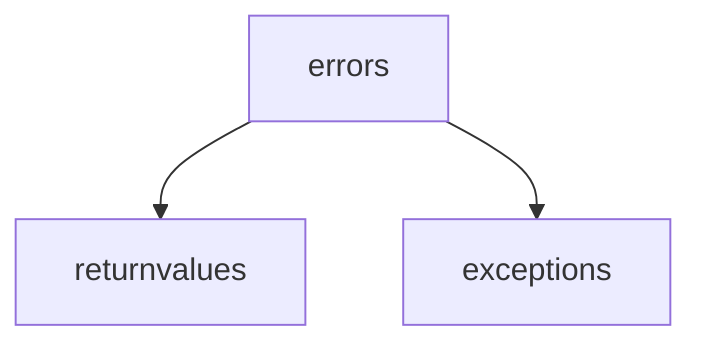
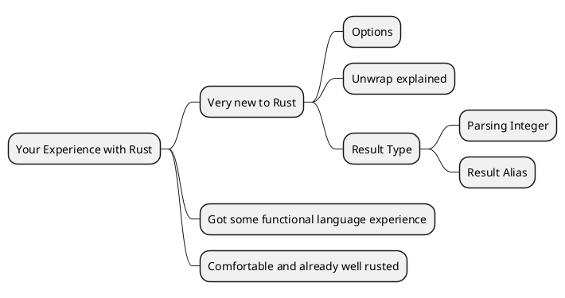
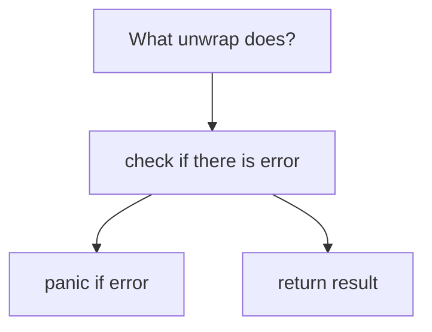

---
## Objective
To deep dive into variety of error handling examples and their 
concept
---

###### Ideas learnt: How to deal with errors in Rust

    Trying to extract the read material into map using plantuml MindMap





What `unwrap` does? It abstracts the case analysis and panic's if fails

`expect` does exactly the same thing as `unwrap`, except it prints a message you give to `expect`.

map_err maps a function on to the *error* portion of a `Result` value.

ok_or is to convert an `Option` into a `Result`. The conversion requires you to specify what error to use if `Option` is `None`



Use `unwrap` to first write the code, and then decide where the error can be handled

When different type of errors can occur, first convert it to *common type which is a string*

`and_then` is used to chain multiple computations where each computation could return an error. After opening the file, there are two more computations that could fail: reading from the file and parsing the contents as a number. Correspondingly, there are two calls to `and_then`.

`try!` macro makes it easy to simplify our error handling. Since it does the case analysis and the early return for us,

###### What is purpose of Option?

> Express the possibility of absence of something

```rust
enum Option<T> {
    None,
    Some(T)
}
```

> **which means figuratively**

```plantuml
enum Option {
    None
    Some_value
}

class Somevalue{

}
class None{

}
Option::None --> None
Option::Some_value --> Somevalue
```

###### What is purpose of Result

> Express possibility of error
> 
> `Result` provides more information than simply “absence.” , I expresses *why* the parsing failed.

```rust
enum Result<T, E> {
    Err(E),
    Ok(T)
}
```

```plantuml
enum Result {
    Err
    Ok
}

class Err{
    E
}
class Ok{
    T
}
Result::Err --> Err::E
Result::Ok --> Ok::T
```

Option as Result:

```rust
type Option<T> = Result<T, ()> 

type Result<T> = std::result::Result<T, ParseIntError>

// This allows to use "if let" like below

if let Ok(val) = double_some("50") {
    println!("Value of val: {}", val)
}
```

Handling *composition of distinct error types* is the next challenge in front of us

> When Option cannot be Composed with Result, then "Convert Option to a Result".
> 
> Composing different errors to String can have following downside:
> 
> > - String can be lossy, meaning the actual error reason can be lost
> > 
> > - String clutter our code, by writing it with expect or println
> 
> ```rust
> use std::io;
> use std::num;
> //derive Debug on the error, as it is required for 
> //readable errors
> #[derive(Debug)]
> enum CliError {
>     Io(io::Error),
>     Parse(num::ParseIntError)
> }
> // following code is where the error traits are implemented
> // for the CliError enum
> use std::error;
> use std::fmt;
> 
> impl fmt::Display for CliError {
>     fn fmt(&self, f: &mut fmt::Formatter) -> fmt::Result {
>         match *self {
>             // Both underlying errors already impl `Display`, so we defer to
>             // their implementations.
>             CliError::Io(ref err) => write!(f, "IO error: {}", err),
>             CliError::Parse(ref err) => write!(f, "Parse error: {}", err),
>         }
>     }
> }
> 
> impl error::Error for CliError {
>     fn description(&self) -> &str {
>         // Both underlying errors already impl `Error`, so we defer to their
>         // implementations.
>         match *self {
>             CliError::Io(ref err) => err.description(),
>             // Normally we can just write `err.description()`, but the error
>             // type has a concrete method called `description`, which conflicts
>             // with the trait method. For now, we must explicitly call
>             // `description` through the `Error` trait.
>             CliError::Parse(ref err) => error::Error::description(err),
>         }
>     }
> 
>     fn cause(&self) -> Option<&error::Error> {
>         match *self {
>             // N.B. Both of these implicitly cast `err` from their concrete
>             // types (either `&io::Error` or `&num::ParseIntError`)
>             // to a trait object `&Error`. This works because both error types
>             // implement `Error`.
>             CliError::Io(ref err) => Some(err),
>             CliError::Parse(ref err) => Some(err),
>         }
>     }
> }
> ```
> 
> refer to the *pub fn file_dbl_composed* in the error_basics

###### Two Integral Traits for Error handling

`std::error::Error` & [`std::convert::From`](http://doc.rust-lang.org/std/convert/trait.From.html).

> ```rust
> use std::fmt::{Debug, Display};
> 
> trait Error: Debug + Display {
>   /// A short description of the error.
>   fn description(&self) -> &str;
> 
>   /// The lower level cause of this error, if any.
>   fn cause(&self) -> Option<&Error> { None }
> }
> ```
> 
> > review the Debug, Display, description & cause, they are essential for looking at the error

###### Implement the From: (Avoid Into)

```rust
trait From<T> {
    fn from(T) -> Self;
}

// Some examples
let string: String = From::from("foo");
let bytes: Vec<u8> = From::from("foo");
let cow: ::std::borrow::Cow<str> = From::from("foo");

// From can be used for working with Errors also
impl<'a, E: Error + 'a> From<E> for Box<Error + 'a>
```

A value-to-value conversion that consumes the input value. The opposite of [`From`](https://doc.rust-lang.org/std/convert/trait.From.html "trait std::convert::From").

One **should avoid implementing [`Into`](https://doc.rust-lang.org/std/convert/trait.Into.html "trait std::convert::Into") and implement [`From`](https://doc.rust-lang.org/std/convert/trait.From.html "trait std::convert::From") instead** 

Implementing [`From`](https://doc.rust-lang.org/std/convert/trait.From.html "trait std::convert::From") automatically provides one with an implementation of [`Into`](https://doc.rust-lang.org/std/convert/trait.Into.html "trait std::convert::Into") thanks to the blanket implementation in the standard library.

Prefer using [`Into`](https://doc.rust-lang.org/std/convert/trait.Into.html "trait std::convert::Into") over [`From`](https://doc.rust-lang.org/std/convert/trait.From.html "trait std::convert::From") when specifying trait bounds on a generic function to ensure that types that only implement [`Into`](https://doc.rust-lang.org/std/convert/trait.Into.html "trait std::convert::Into") can be used as well.

###### Three things handled by the ? operator

> - Case Analysis
> 
> - Control Flow
> 
> - Error Type conversion

> ```rust
> 
> ```
