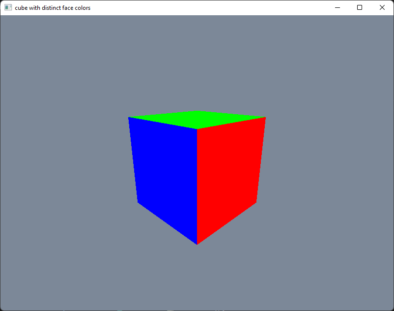

# Rust *wgpu* Graphics Programming: Step-By-Step (8) 
## Animate a 3D Cube

This is the source code for 8th video of the YouTube series on step-by-step Rust *wgpu* graphics programming.

This sample *wgpu* app shows how to animate a 3D cube. The output from this app is shown in the following image.

## Link for All Source Code Used in the Rust *wgpu* Step-By-Step Video Series:

https://github.com/jack1232/wgpu-Step-By-Step

